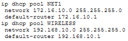
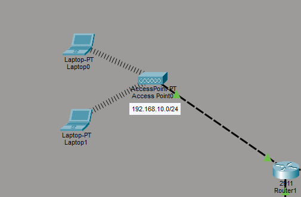
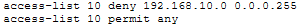
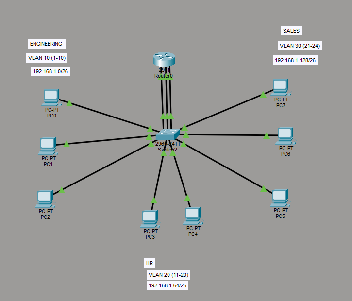
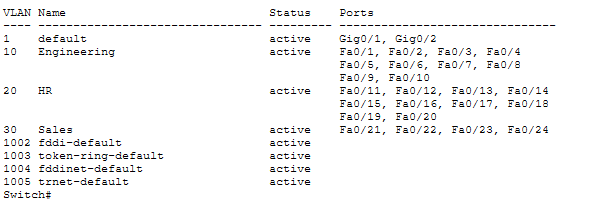

# Hands-On Networking & Cybersecurity Experience

Practical networking and cybersecurity labs using Cisco Packet Tracer.

**Focus areas:** Network configuration, routing, DHCP, ACLs, wireless, VLANs, and basic network security.

---

## Skills Demonstrated

- Router interface configuration (CLI)
- Static routing and default routing
- DHCP pool configuration
- Access Control Lists (ACLs)
- Wireless network setup
- Multi-router topologies
- VLAN creation and port assignment
- Network segmentation and basic security controls

---

## General Topology


Overall Packet Tracer topology used across earlier labs (routers, switches, servers, PCs, laptops, and wireless access point).

---

## 1. Multi-Network Topology with Two Routers (Static Routing)

### Overview
Configured two Cisco routers (2911) to interconnect multiple networks. Devices on different subnets communicate through the routers acting as default gateways.

### Topology Summary

**Router 1 (2911)**
- Access Point → 192.168.10.0/24 (wireless network)
- Switch (2960-24TT) → 192.168.20.0/24 (PC1 and PC2)
- Point-to-point link to Router 2: 10.10.10.0/30

**Router 2 (2911)**
- Internal Server 0: 172.16.10.0/24
- Internal Server 1: 172.16.20.0/24
- Point-to-point link back to Router 1: 10.10.10.0/30

### What I Configured
- Assigned IP addresses to router interfaces using CLI
- Brought interfaces up with `no shutdown`
- Set router interface IPs as default gateways for each network
- Interconnected the two networks so devices can reach across routers

### Key Concepts Practiced
- Basic router interface configuration via CLI
- Using routers as default gateways
- Connecting different LANs through a point-to-point link
- Subnetting (/24 and /30)

### Result
Devices on the 192.168.10.0/24 and 192.168.20.0/24 networks could communicate with each other and reach the servers on the Router 2 side.

---

## 2. DHCP + Default Routing

### Overview
Extended the multi-router lab by implementing DHCP for automatic IP assignment and default routing for simpler traffic forwarding.

### What I Configured

**DHCP**
- Created IP pools on the routers
- Configured DHCP so end devices automatically receive IP addresses, subnet masks, and default gateways

**DHCP Configuration Example:**



```
ip dhcp pool NET1
 network 172.16.10.0 255.255.255.0
 default-router 172.16.10.1
ip dhcp pool WIRELESS
 network 192.168.10.0 255.255.255.0
 default-router 192.168.10.1
```

**Default Routing**


```
ip route 0.0.0.0 0.0.0.0 10.10.10.2
```


```
ip route 0.0.0.0 0.0.0.0 10.10.10.1
```

### Key Concepts Practiced
- DHCP pool configuration and automatic IP assignment
- Default routes (`0.0.0.0/0`) vs specific static routes
- How routers use the default route when no more specific match exists

### Result
End devices now receive IP configuration automatically via DHCP. Routers forward traffic for unknown networks using the default route, simplifying configuration.

---

## 3. Wireless Connectivity + ACL Security Lab

### Overview
Expanded the topology with a dedicated wireless network and implemented an Access Control List (ACL) to restrict traffic for security purposes.

### Topology Updates
- Added Access Point with three laptops
- Wireless network: **192.168.10.0/24**
- Router provides DHCP for the wireless network
- Servers on **192.168.2.0** network

### What I Configured

**Wireless Network**



- Connected Access Point to a router interface
- Configured DHCP pool for the wireless network
- Verified wireless clients obtain IPs and communicate within their network

**ACL (Security Rule)**


```
access-list 10 deny 192.168.10.0 0.0.0.255
access-list 10 permit any
```



- Created a standard ACL to block the wireless network (192.168.10.0/24) from reaching other networks
- Applied the ACL on the relevant router interface
- Purpose: Basic network segmentation / security control

### Key Concepts Practiced
- Wireless client connectivity in Packet Tracer
- Using a router as DHCP server for a wireless network
- Writing and applying ACLs to deny traffic between networks
- Basic network security through traffic filtering

### Result
- Wireless laptops successfully join the network and receive IPs via DHCP
- ACL successfully prevents devices on the wireless network from reaching the servers
- Other networks remain unaffected

---

## 4. VLANs and Network Segmentation

### Overview
Configured VLANs on a Cisco 2960 switch to segment the network into three departments: Engineering, HR, and Sales. Each VLAN has its own subnet.

### Topology



- One 2960-24TT switch
- One 2911 router connected to the switch
- Multiple PCs assigned to different VLANs

### VLAN Configuration

| VLAN ID | Name        | Ports              | Subnet              |
|---------|-------------|--------------------|---------------------|
| 10      | Engineering | Fa0/1 – Fa0/10    | 192.168.1.0/26     |
| 20      | HR          | Fa0/11 – Fa0/20   | 192.168.1.64/26    |
| 30      | Sales       | Fa0/21 – Fa0/24   | 192.168.1.128/26   |

**Show VLAN output:**



### What I Configured
- Created VLANs 10, 20, and 30 on the switch
- Assigned access ports to the appropriate VLANs
- Configured corresponding subnets for each department
- Connected the switch to a router for inter-VLAN communication

### Key Concepts Practiced
- Creating and naming VLANs
- Assigning switch ports to VLANs
- Network segmentation by department
- Understanding broadcast domains
- Basic inter-VLAN connectivity preparation

### Result
- Devices within the same VLAN can communicate with each other
- Devices in different VLANs are segmented and require routing to communicate
- Network is logically divided into Engineering, HR, and Sales departments

---

## Next Labs

- Inter-VLAN routing (Router-on-a-Stick)
- More advanced ACL scenarios
- Basic network security hardening

---

More labs will be added as I continue practicing.
