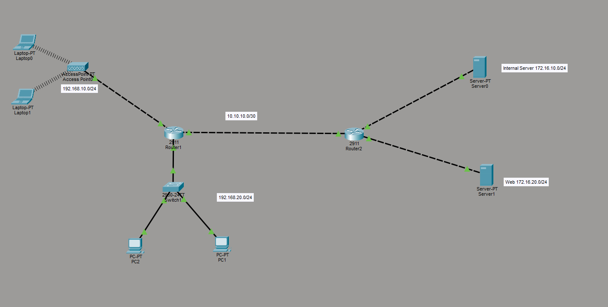

# Hands-On Experience

Documentation of my practical networking and cybersecurity work during SIWES and personal labs.

**SIWES 1 — Completed**

---

## General Topology



This is the overall Packet Tracer topology used across the labs (multiple routers, switches, servers, PCs, laptops, and wireless access point).

---

## 1. Multi-Network Topology with Two Routers (Static Routing)

### Overview
Configured two Cisco routers (2911) in Packet Tracer to interconnect multiple networks. Devices on different subnets communicate through the routers acting as default gateways.

### Topology Summary

**Router 1 (2911)**
- Connected to Access Point → 192.168.10.0/24 (wireless network with laptops)
- Connected to Switch (2960-24TT) → 192.168.20.0/24 (two PCs: PC1 and PC2)
- Point-to-point link to Router 2: 10.10.10.0/30

**Router 2 (2911)**
- Connected to Internal Server 0: 172.16.10.0/24
- Connected to Internal Server 1: 172.16.20.0/24
- Point-to-point link back to Router 1: 10.10.10.0/30

### What I Configured
- Assigned IP addresses to router interfaces using CLI
- Brought the interfaces up with `no shutdown`
- Set the router interface IPs as default gateways for the devices in each network
- Interconnected the two networks so devices can reach across routers

### Key Concepts Practiced
- Basic router interface configuration via CLI
- Using routers as default gateways
- Connecting different networks (LANs) through a point-to-point link
- Understanding subnetting (/24 and /30)

### Result
Devices on the 192.168.10.0/24 and 192.168.20.0/24 networks could communicate with each other and reach the servers on the Router 2 side through the interconnected routers.

---

## 2. DHCP + Default Routing (SIWES Update)

### Overview
Extended the previous multi-router lab by implementing DHCP for automatic IP assignment and default routing for simpler traffic forwarding.

### What I Configured

**DHCP**
- Created IP pools on the routers
- Configured DHCP services so end devices (PCs and laptops) automatically receive IP addresses, subnet masks, and default gateways

**Default Routing**
- Used the command:
  ```
  ip route 0.0.0.0 0.0.0.0 <next-hop-ip>
  ```
- This sets a default route so the router forwards traffic for any unknown destination to the specified next-hop (usually the other router or exit interface)

### Key Concepts Practiced
- DHCP pool configuration and IP address assignment
- Default routes (`0.0.0.0/0`) vs specific static routes
- How routers use the default route when no more specific match exists in the routing table
- Practical difference between static routing and default routing in small topologies

### Result
End devices now receive their IP configuration automatically via DHCP instead of manual static assignment. Routers can forward traffic to unknown networks using the default route, simplifying the configuration compared to writing individual static routes for every network.

---

## 3. Wireless Connectivity + ACL Security Lab

### Overview
Expanded the topology with a dedicated wireless network and implemented an Access Control List (ACL) to restrict traffic for security purposes.

### Topology Updates
- Added Access Point with three laptops (Laptop2, Laptop3, Laptop4)
- Assigned the wireless devices to network **192.168.5.0/24**
- Router (ISR 4331 - Router8) provides DHCP for the wireless network
- Servers remain on **192.168.2.0** network

### What I Configured

**Wireless Network**
- Connected Access Point to a router interface
- Configured DHCP pool on the router for 192.168.5.0/24 so the laptops receive IP addresses automatically
- Verified wireless clients can obtain IPs and communicate within their network

**ACL (Security Rule)**
- Created a standard/extended ACL to **block the entire 192.168.5.0/24 wireless network** from communicating with the **192.168.2.0 server network**
- Applied the ACL in the appropriate direction on the relevant router interface
- Purpose: Prevent wireless clients from accessing the server network (basic network segmentation / security control)

### Key Concepts Practiced
- Wireless client connectivity in Packet Tracer
- Using a router as DHCP server for a wireless network
- Writing and applying ACLs to deny traffic between specific networks
- Understanding inbound vs outbound ACL direction
- Basic network security through traffic filtering

### Result
- Wireless laptops successfully join the 192.168.5.0/24 network via the Access Point and receive IPs from the router’s DHCP pool
- ACL successfully prevents devices on 192.168.5.0/24 from reaching the servers on 192.168.2.0
- Other networks remain unaffected

---

**SIWES 1 completed.**  
More labs and configurations will be added during SIWES 2 and personal practice.
